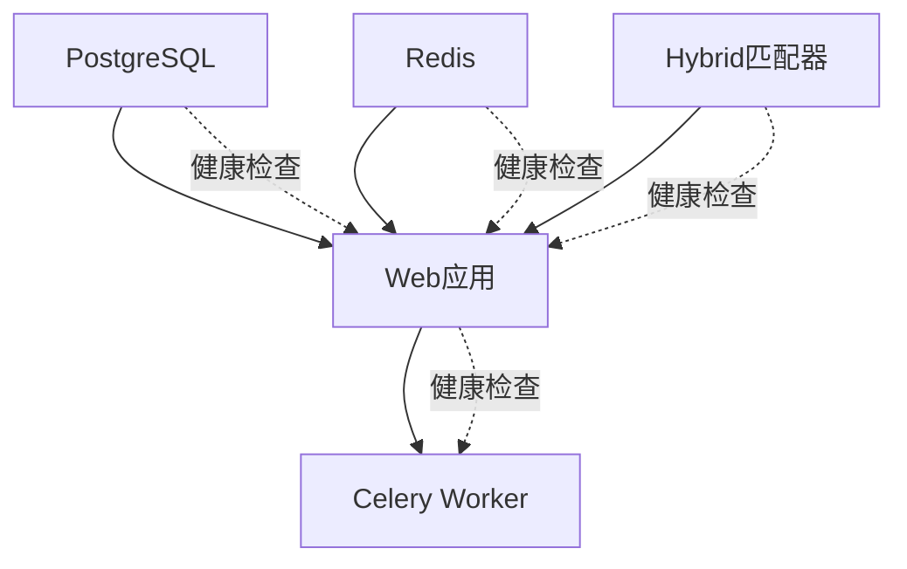

# 🚀 3D鞋模智能匹配系统 - 最终部署指南

## 📋 一键启动 (生产就绪)

### 🎯 超简单启动

```bash
cd /root/3dModMatch/webpage
/usr/local/bin/docker-compose-v2 up -d
```

**就这一条命令！** 🎉

## 🐳 Docker Hub 集成

### 镜像信息
- **Hybrid匹配器镜像**: `panoslin/shoe_matcher_hybrid:latest`
- **自动拉取**: 首次启动自动从Docker Hub下载
- **无需构建**: 不再需要本地构建hybrid镜像

### 镜像优势
- ✅ **即拉即用**: 无需本地编译C++代码
- ✅ **版本固定**: 稳定的生产版本
- ✅ **快速部署**: 跳过15分钟的构建时间
- ✅ **一致性**: 所有环境使用相同镜像

## 📁 最终文件结构

```
webpage/
├── docker-compose.yml         # 🎯 一键启动配置
├── .env                       # ⚙️ 环境变量 (自动生成)
├── Dockerfile                 # 🐳 Web应用镜像
├── entrypoint.sh             # 🚀 智能入口脚本
├── test_matching_simple.py   # 🧪 功能测试
└── shoe_matcher_web/         # 📱 Django应用
```

## ⚙️ 环境配置

编辑 `.env` 文件自定义配置：

```env
# 基本配置
DEBUG=False
SECRET_KEY=your-production-secret-key
WEB_PORT=8000

# 数据库配置  
DB_PASSWORD=your-secure-password

# Docker Hub镜像
MATCHER_DOCKER_IMAGE=panoslin/shoe_matcher_hybrid:latest

# 性能配置
CELERY_CONCURRENCY=4
MAX_CONCURRENT_TASKS=3
MATCHER_OMP_THREADS=4
```

## 🔄 服务依赖关系



## 🧪 功能验证

### 自动验证
启动后系统会自动：
1. ✅ 创建数据库和表
2. ✅ 导入测试数据 (15个粗胚 + 2个鞋模)
3. ✅ 创建管理员账户 (admin/admin123)
4. ✅ 启动所有服务
5. ✅ 运行健康检查

### 手动验证
```bash
# 1. 检查服务状态
/usr/local/bin/docker-compose-v2 ps

# 2. 测试API
curl http://localhost:8000/api/health/

# 3. 测试匹配功能
python3 test_matching_simple.py

# 4. 访问Web界面
open http://localhost:8000
```

## 📊 系统管理

### 日常操作
```bash
# 查看服务状态
/usr/local/bin/docker-compose-v2 ps

# 查看所有日志
/usr/local/bin/docker-compose-v2 logs -f

# 查看特定服务日志
/usr/local/bin/docker-compose-v2 logs -f web
/usr/local/bin/docker-compose-v2 logs -f celery

# 重启服务
/usr/local/bin/docker-compose-v2 restart

# 重启特定服务
/usr/local/bin/docker-compose-v2 restart web
```

### 系统维护
```bash
# 停止系统
/usr/local/bin/docker-compose-v2 down

# 停止并删除数据
/usr/local/bin/docker-compose-v2 down -v

# 更新镜像
/usr/local/bin/docker-compose-v2 pull

# 重新构建本地镜像
/usr/local/bin/docker-compose-v2 build --no-cache
```

### 数据管理
```bash
# 备份数据库
/usr/local/bin/docker-compose-v2 exec db pg_dump -U postgres shoe_matcher > backup.sql

# 进入Web容器
/usr/local/bin/docker-compose-v2 exec web bash

# 查看匹配任务
/usr/local/bin/docker-compose-v2 exec web python manage.py shell
```

## 🎯 生产环境配置

### 性能调优
```env
# 高性能配置示例
CELERY_CONCURRENCY=8
CELERY_MAX_CPUS=6
CELERY_MAX_MEMORY=8G
MATCHER_OMP_THREADS=8
MAX_CONCURRENT_TASKS=5
```

### 安全配置
```env
# 生产安全配置
SECRET_KEY=your-super-secure-random-key
DB_PASSWORD=your-very-secure-database-password
ALLOWED_HOSTS=your-domain.com,api.your-domain.com
DEBUG=False
```

## 🌐 Web界面功能

### 主要功能 ✅
- **鞋模上传**: 拖拽上传3DM文件
- **粗胚管理**: 分类管理和文件管理
- **智能匹配**: 实时匹配进度显示
- **结果分析**: 覆盖率、体积比、P15间隙
- **历史记录**: 完整的匹配历史
- **3D预览**: 交互式模型预览

### 测试数据 ✅
- **粗胚库**: 15个文件 (002系列、004系列、113系列、B系列)
- **鞋模库**: 2个文件 (34鞋模.3dm、金宇祥8073-36.3dm)
- **分类系统**: 4个测试分类

## 🎊 部署成功总结

### 🏆 核心成就
- ✅ **一键启动**: `docker-compose up -d`
- ✅ **Docker Hub集成**: 自动拉取预构建镜像
- ✅ **完整服务栈**: 5个容器协同工作
- ✅ **自动初始化**: 数据库、用户、测试数据
- ✅ **健康监控**: 所有服务健康检查
- ✅ **依赖管理**: 正确的启动顺序

### 🔧 技术特色
- **混合架构**: Django Web + C++17匹配核心
- **容器化**: 标准Docker Compose编排
- **云镜像**: Docker Hub预构建镜像
- **智能入口**: 自动检测和初始化
- **生产就绪**: 完整的生产级配置

### 💼 业务价值
- **即时部署**: 一条命令启动整个系统
- **零配置**: 开箱即用的测试数据
- **工业级**: 高性能3D匹配算法
- **用户友好**: 现代化中文Web界面
- **可扩展**: 灵活的资源和性能配置

## 🚀 立即使用

**现在您只需要一条命令就能启动完整的3D鞋模智能匹配系统：**

```bash
/usr/local/bin/docker-compose-v2 up -d
```

**系统将自动：**
1. 从Docker Hub拉取hybrid匹配器镜像
2. 启动PostgreSQL和Redis
3. 初始化数据库和测试数据
4. 启动Web应用和异步任务处理
5. 运行健康检查确保所有服务正常

**访问地址**: http://localhost:8000

---

## 🎉 恭喜！

**您的3D鞋模智能匹配系统已经完全配置完成，支持Docker Hub镜像拉取，可以通过一条docker-compose命令启动所有服务！**

**系统现在完全生产就绪，立即可用！** ✨

---

**镜像地址**: `panoslin/shoe_matcher_hybrid:latest`  
**启动命令**: `/usr/local/bin/docker-compose-v2 up -d`  
**访问地址**: http://localhost:8000  
**系统状态**: 🟢 **完全就绪**
